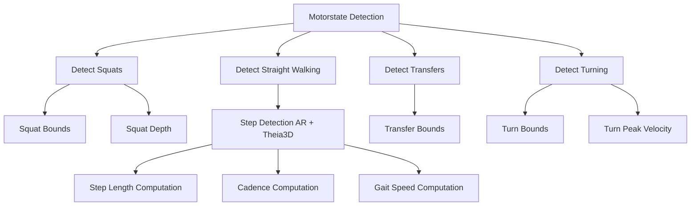

# Motorstate Detection and Gait Metrics Repository

This repository contains algorithms used for detecting motor states and computing gait and squat metrics from head and body motion capture data.  
All algorithms are provided as **markdown files** with pseudocode, inputs, outputs, and implementation notes for reproducibility in scientific research.

---

## Algorithm Workflow

This flowchart shows the general pipeline:

1. **Motorstate Detection**: Identifies squats, straight walking, transfers, and turning events from motion capture data.  
2. **Metric Computation**: Once motor states are detected, the algorithms compute metrics such as step length, cadence, gait speed, squat depth, transfer bounds, and turn characteristics.

---

## License

This repository is shared under the **Creative Commons Attribution-NonCommercial 4.0 International (CC BY-NC 4.0)** license. You are free to:

- Share — copy and redistribute the material in any medium or format  
- Adapt — remix, transform, and build upon the material  

**Under the following terms:**

- **Attribution** — You must give appropriate credit, provide a link to the license, and indicate if changes were made.  
- **NonCommercial** — You may not use the material for commercial purposes.  

[CC BY-NC 4.0 License](https://creativecommons.org/licenses/by-nc/4.0/)

---

## References

The pseudocode in this repository is based on the following references, among others:

- Shah, V. V., Curtze, C., Mancini, M., Carlson-Kuhta, P., Nutt, J. G., Gomez, C. M., El-Gohary, M., Horak, F. B., & McNames, J. (2021). *Inertial Sensor Algorithms to Characterize Turning in Neurological Patients With Turn Hesitations.* IEEE Transactions on Biomedical Engineering, 68(9), 2615–2625. [DOI](https://doi.org/10.1109/TBME.2020.3037820)
