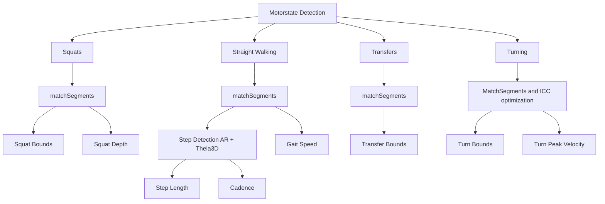

# Motorstate Detection and Mobility Metrics Repository

**Purpose**  
This repository contains pseudocode and algorithm descriptions used for the detection of motor states and associated metrics from head motion capture and AR systems.  
It accompanies the associated scientific article (https://doi.org/10.20944/preprints202510.1248.v1) to improve reproducibility and clarity of the methods.

---

## Algorithm Workflow




This flowchart shows the general pipeline:

1. **Motorstate Detection**: Identifies squats, straight walking, transfers, and turning events from motion capture data and AR system data. 
2. **Matching Segments**: Matches motorstates segments and computes agreement metrics: precision, recall, F1 score, and temporal overlap.
3. **Metric Computation**: Once motor states are detected, the algorithms compute mobility metrics within that motorstate.

---
## Dataset Description

The repository includes a processed dataset (`dataset.mat`) in MATLAB `.mat` format containing 3D position and orientation data from head-mounted AR devices and Theia3D motion capture.

Each entry corresponds to a single participant and game session:

```matlab
dataset.participant   % Participant identifier
dataset.game          % Game identifier
```

--- 
### AR Device Data (`ARdata`)

Contains head-tracking measurements from the AR headset:

- `ARdata.x`, `.y`, `.z` – 3D position coordinates  
- `ARdata.roll`, `pitch`, `yaw` – orientation angles in radians

--- 

### Theia3D Motion Capture Data (`Theiadata`)

#### Head Segment

- `Theiadata.head.x`, `.y`, `.z` – 3D position  
- `Theiadata.head.roll`, `.pitch`, `.yaw` – orientation angles in radians

#### Pelvis Segment

- `Theiadata.pelvis.x`, `.y`, `.z` – 3D position  
- `Theiadata.pelvis.roll`, `.pitch`, `.yaw` – orientation angles in radians

#### Left and Right Feet

- `Theiadata.lfoot.x`, `.y`, `.z` – 3D position 
- `Theiadata.rfoot.x`, `.y`, `.z` – 3D position 

#### Left and Right Toes

- `Theiadata.ltoes.x`, `.y`, `.z` – 3D position  
- `Theiadata.rtoes.x`, `.y`, `.z` – 3D position 
---

## License

This repository is shared under the **Creative Commons Attribution-NonCommercial 4.0 International (CC BY-NC 4.0)** license. You are free to:

- Share — copy and redistribute the material in any medium or format  
- Adapt — remix, transform, and build upon the material  

**Under the following terms:**

- **Attribution** — You must give appropriate credit, provide a link to the license, and indicate if changes were made.  
- **NonCommercial** — You may not use the material for commercial purposes.  

[CC BY-NC 4.0 License](https://creativecommons.org/licenses/by-nc/4.0/)

---

## References

The pseudocode in this repository is based on the following references, among others:

- van Doorn,  P. F., Nyman Jr.,  E., Wishaupt,  K., van der Krogt,  M. M., & Roerdink,  M. (2025). Deriving Motor States and Mobility Metrics from Gamified Augmented Reality Rehabilitation Exercises in People with Parkinson’s Disease. Preprints. https://doi.org/10.20944/preprints202510.1248.v1
- Shah, V. V., Curtze, C., Mancini, M., Carlson-Kuhta, P., Nutt, J. G., Gomez, C. M., El-Gohary, M., Horak, F. B., & McNames, J. (2021). *Inertial Sensor Algorithms to Characterize Turning in Neurological Patients With Turn Hesitations.* IEEE Transactions on Biomedical Engineering, 68(9), 2615–2625. [DOI](https://doi.org/10.1109/TBME.2020.3037820)

